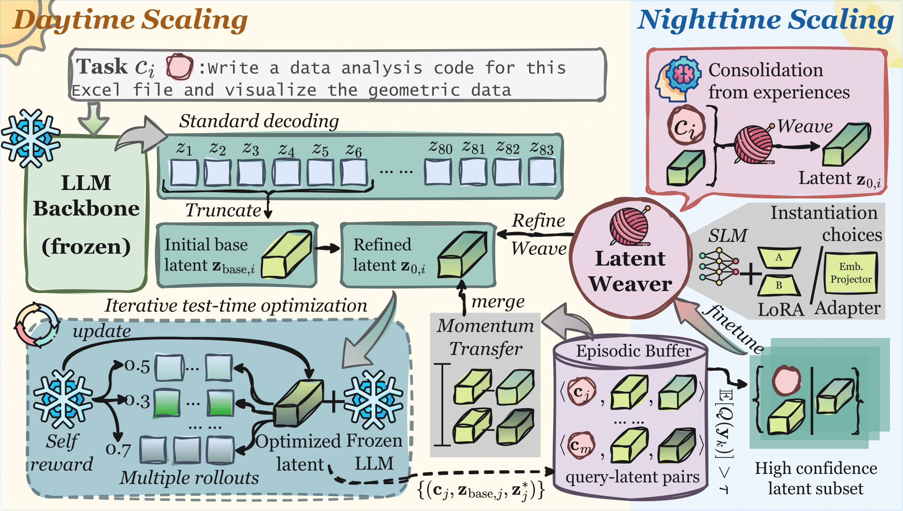

# LatentEvolve: Self-Evolving Test-Time Scaling in Latent Space
## 👋 Overview
We introduces **LatentEvolve** a self-evolving latent test-time scaling framework for large language models, inspired by the Complementary Learning Systems theory. It operates through a **dual-phase evolution**: daytime scaling performs fast, instance-specific latent optimization using episodic traces from previously solved problems, while nighttime scaling consolidates these experiences into a latent weaver that distills procedural knowledge for future tasks. This continual cycle allows models to not only adapt on the fly but also progressively evolve their reasoning capabilities without supervision.

